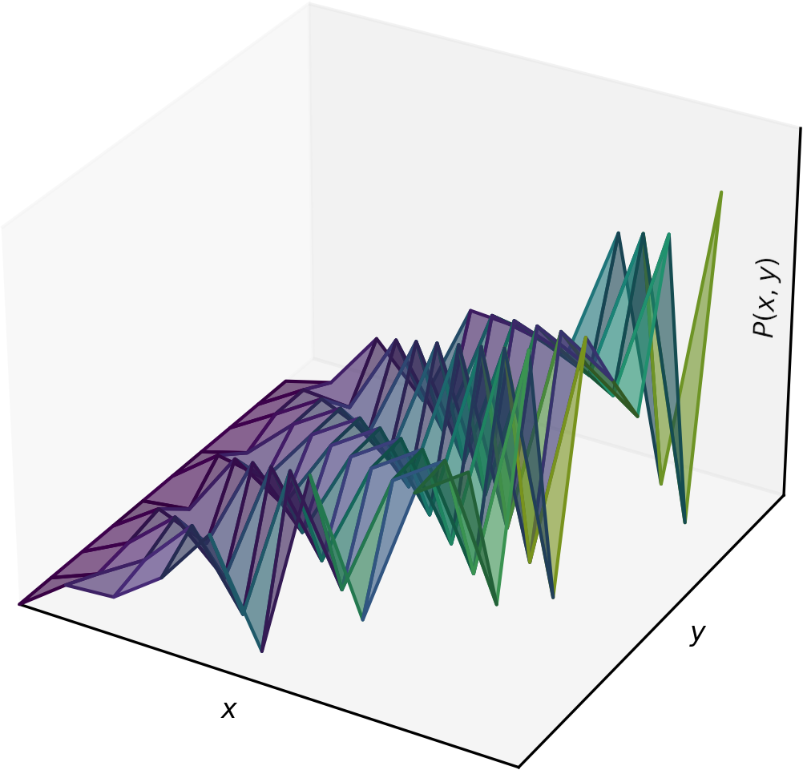

..
   Note: Items in this toctree form the top-level navigation. See `api.rst` for the `autosummary` directive, and for why `api.rst` isn't called directly.

.. toctree::
   :hidden:
   :maxdepth: 0

   Home page <self>
   Get started <installation>
   Theory <theory>
   Jupyter tutorials <tutorials>
   API reference <_autosummary/wmipa>
   Development <development>

.. autosummary::
   :hidden:
   :recursive:

   wmipa

Welcome to the wmipy documentation
==================================

.. centered::
   ``wmipy`` :math:`=` **quantitative reasoning** over **algebraic** and
   **logical constraints** in ``python3``

.. math::

   P(x \ge y \:|\: y / 2 \le \pi) = ??

.. centered::
   ... ``pip install wmipy`` !

   
``wmipy`` is a modular library for solving **Weighted Model
Integration** (WMI) and related quantitative reasoning tasks over
mixed continuous / logical domains.

Our goals:

* Facilitating the integration of state-of-the-art WMI technology into your project
* Providing a flexible framework for the development of novel solvers

Eager to start? :ref:`Install <installation>` it now!

Unfamiliar with WMI? Check our :ref:`theory <theory>` primer.

Curious about advanced use cases? See our Jupyter :ref:`tutorials <tutorials>` and :ref:`API reference <_autosummary/wmipa>`.

Want to contribute? You are :ref:`welcome <development>`!
